# 🧠 AI-Powered HR Management System

An all-in-one, intelligent Human Resource Management System built to streamline HR operations using the power of AI. This platform simplifies employee and candidate management while improving efficiency and decision-making through automation and smart insights.

## ⚙️ Features

- 🕒 **Employee Attendance Tracking**  
  Keep accurate records of daily check-ins and check-outs.

- 📈 **Performance Reviews**  
  Allow HR and team leads to submit and track performance evaluations.

- 📅 **Leave Request Management**  
  Employees can submit leave requests and view their leave history; HR can approve or reject requests.

- 👥 **Role-Based Panels**  
  - **Employee Panel**: Mark attendance, request leaves, see payroll info, and track performance.
  - **HR/Admin Panel**: Manage employees, review requests, track attendance, and oversee payroll.

- 🔐 **User Authentication**  
  Secure session- and cookie-based login system with role-based access control.

- 💰 **Payroll Management**  
  Calculate and manage salaries, deductions, and payslip generation.

- 📋 **Employee Management**  
  Add, edit, and track employee details with ease.

- 🤖 **AI-Powered Candidate Hiring System**  
  Automatically score incoming resumes against job descriptions using machine learning to recommend best-fit candidates.

## 🛠️ Tech Stack

- **Frontend**: React, Tailwind, ShadCN UI  
- **Backend**: Express (Node.js)  
- **Machine Learning**: Python  
- **Database**: PostgreSQL

## Screenshots

### Login

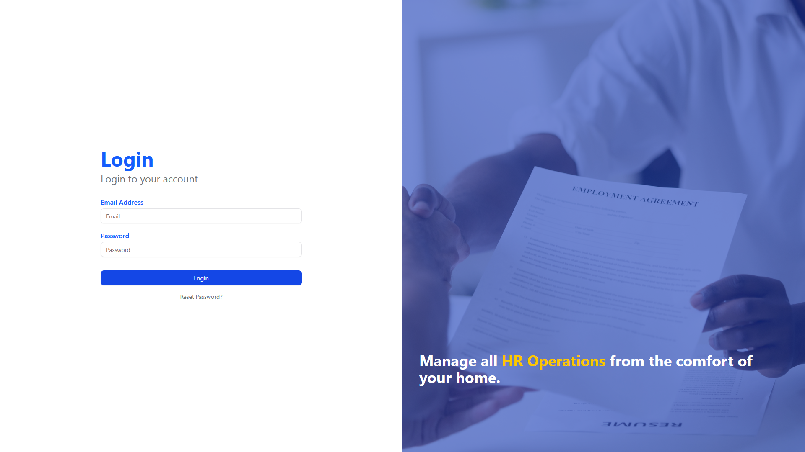

### HR Dashboard

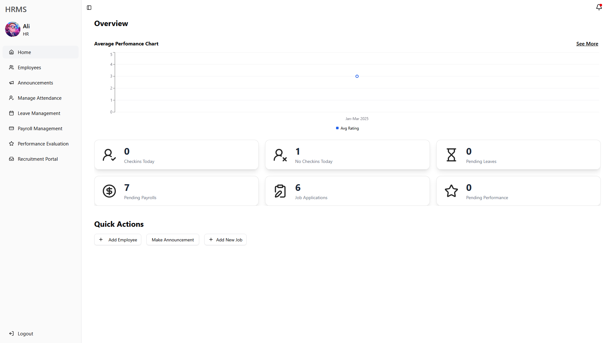

### HR Add Employee

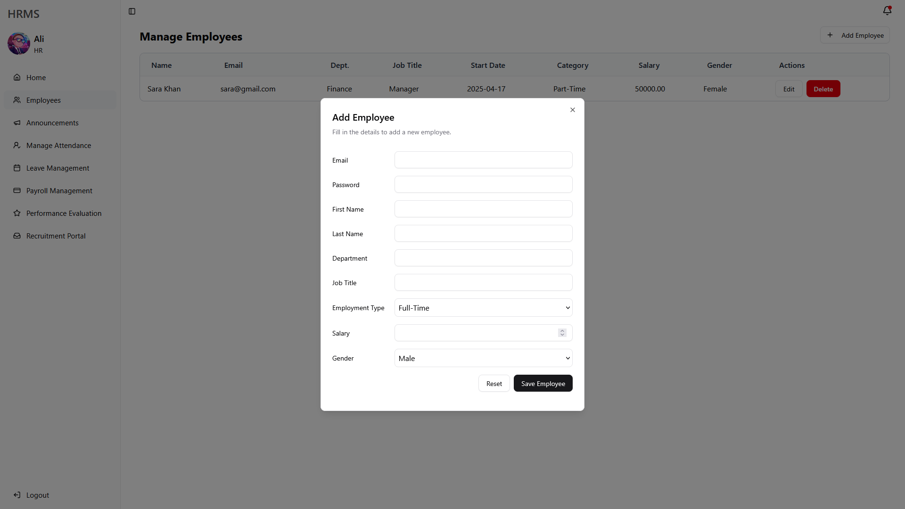

### HR Leave Management

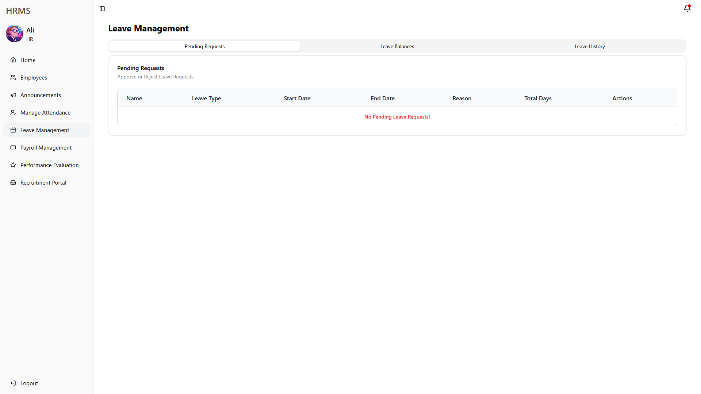

### HR Payroll Management

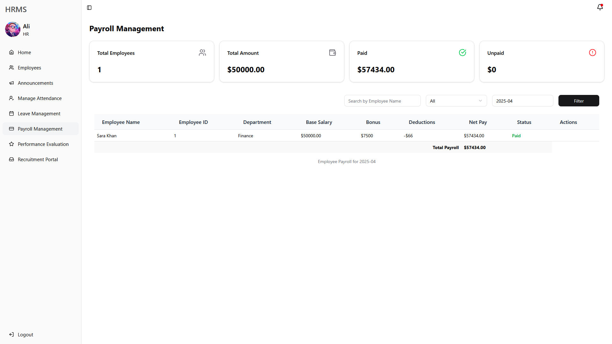

### HR Performance Management

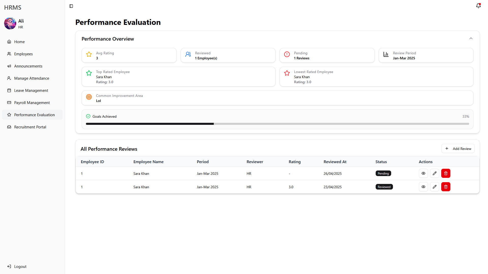

### Announcements

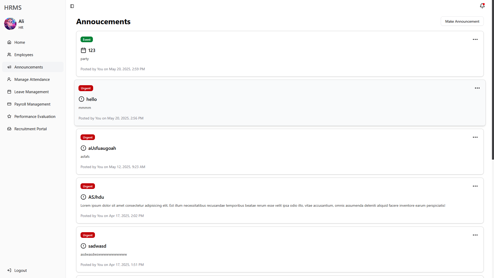

### HR Recruitment Panel

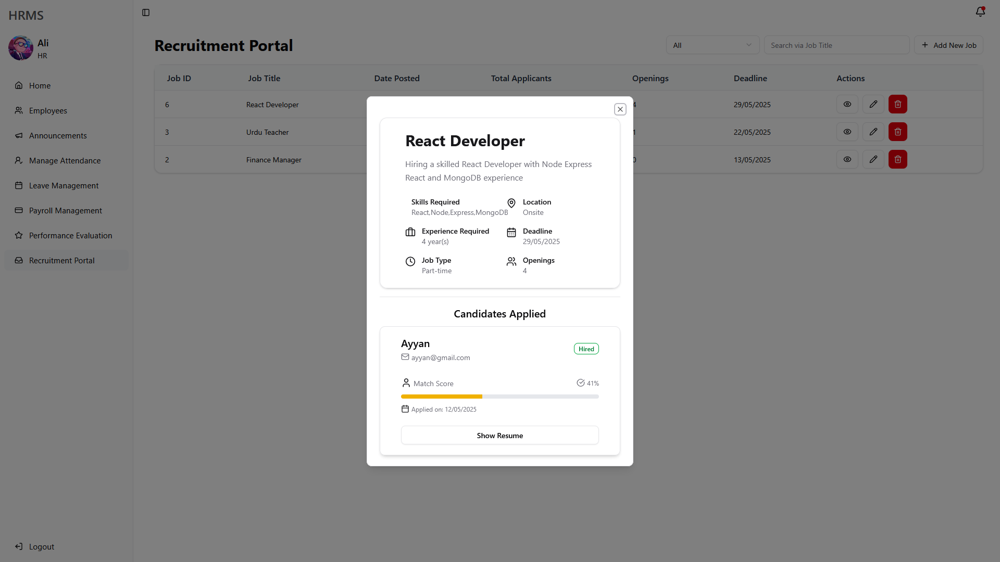

### Employee Dashboard

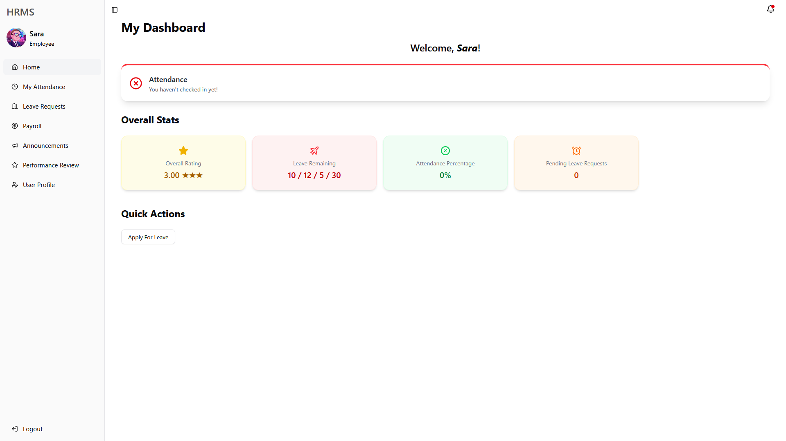

### Employee Attendance

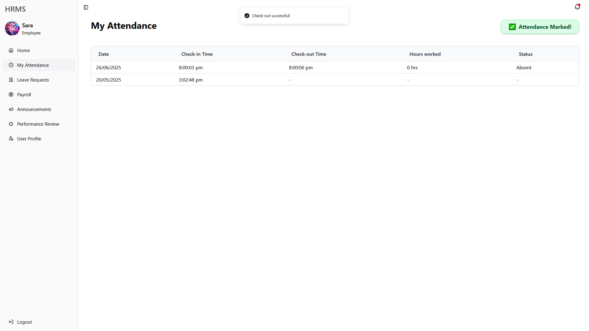

### Employee Leave Request

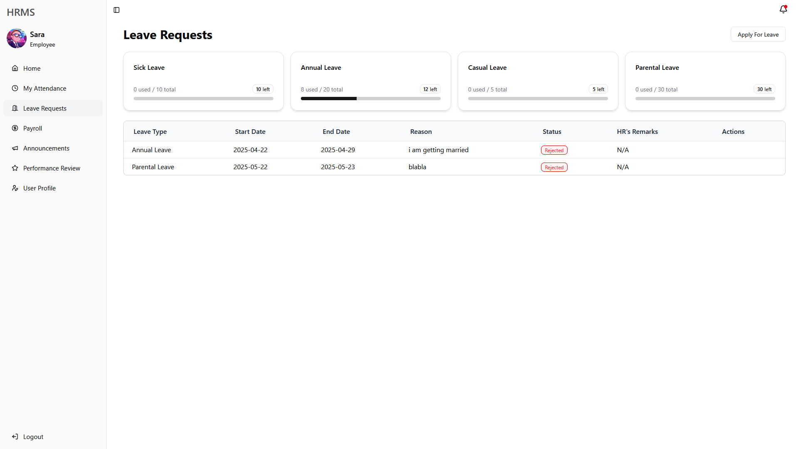

### Employee Performance

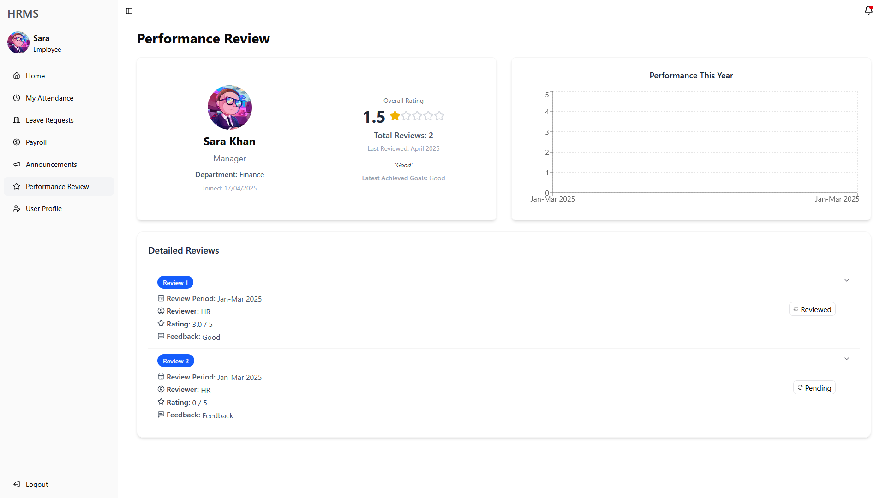

### Employee Profile

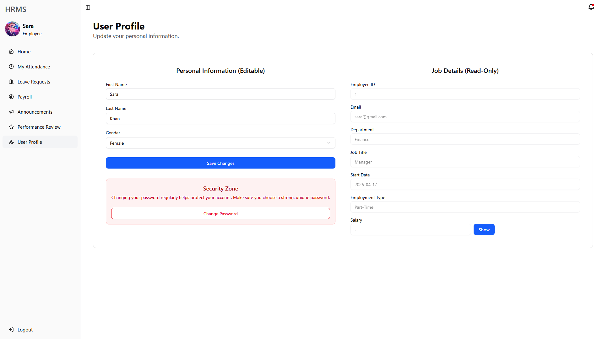

## 🎯 Use Case

Ideal for small to mid-sized companies looking to modernize and automate their HR workflows with minimal manual effort and intelligent tools.
